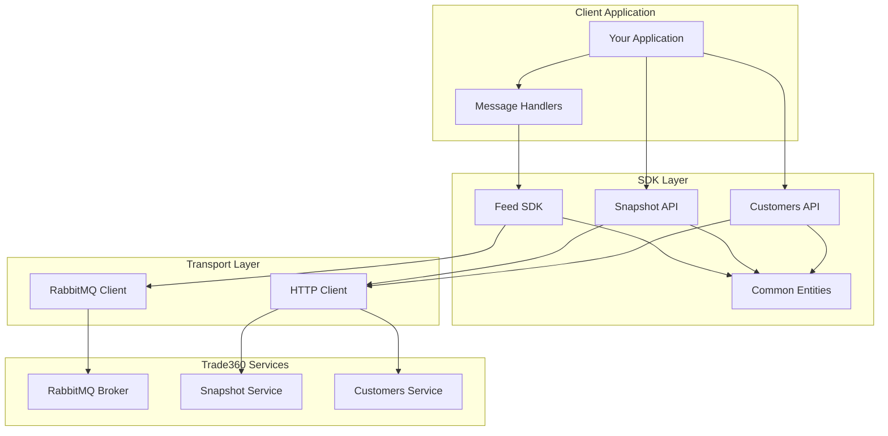
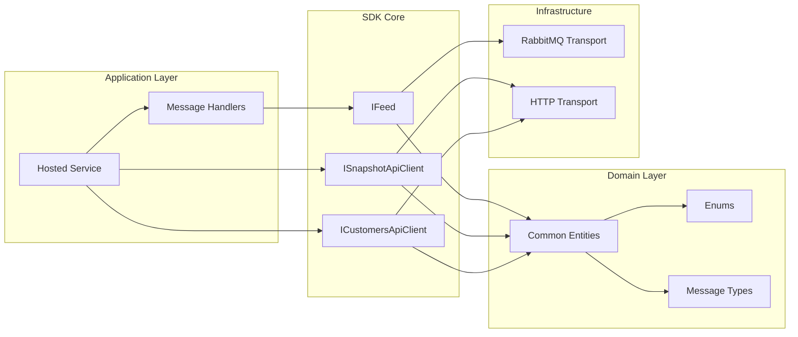
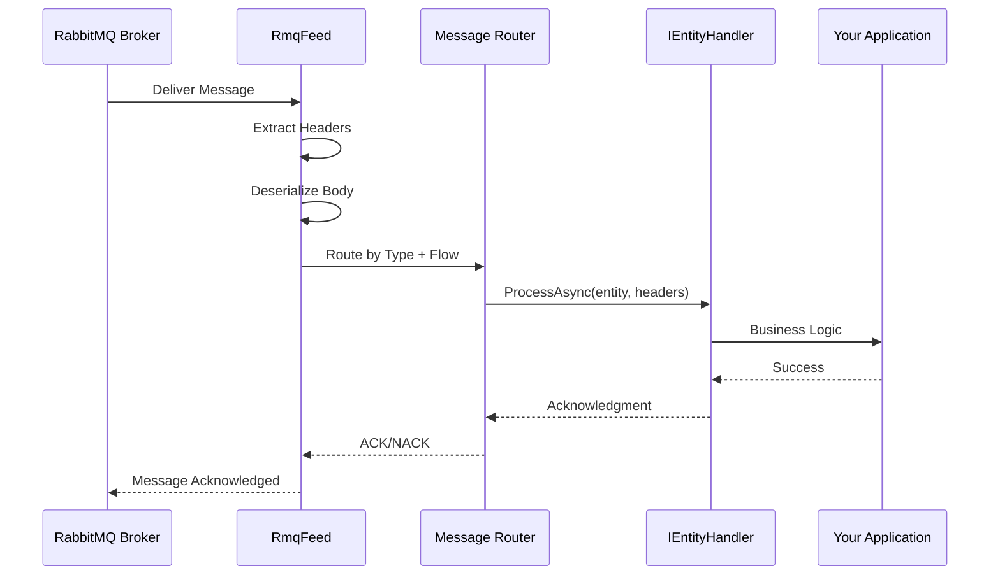
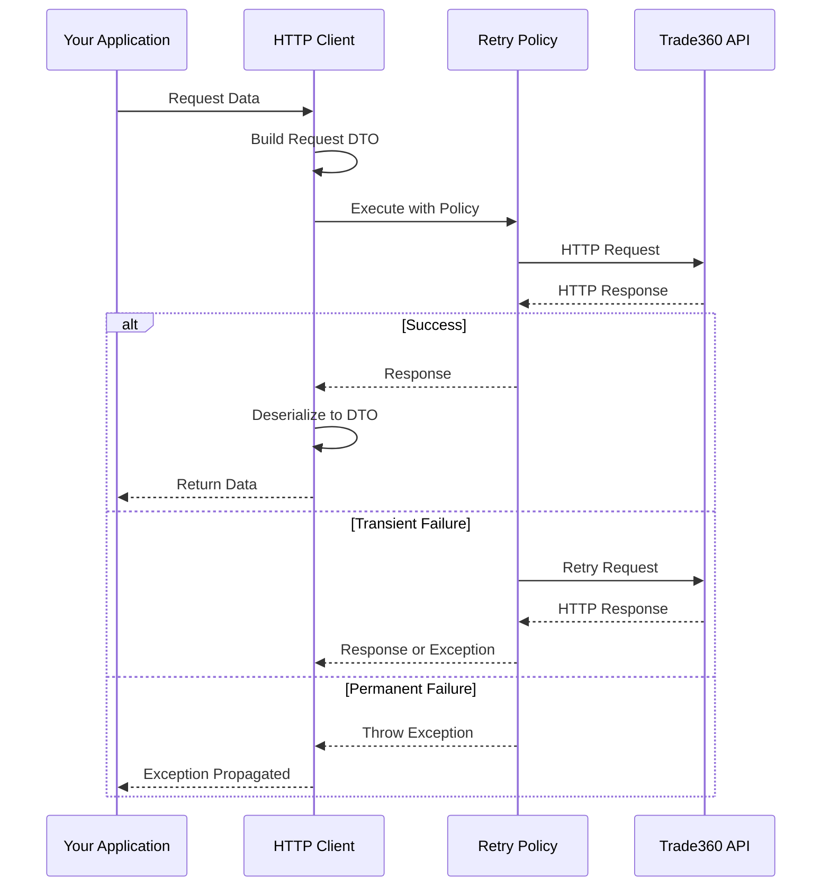

# Trade360 .NET SDK

## 🧾 Project Brief

**Official .NET SDK for LSports Trade360 Services**

The Trade360 .NET SDK is a comprehensive client library that simplifies integration with LSports Trade360 ecosystem. It provides developers with a robust, type-safe interface to consume real-time sports data feeds, manage subscriptions, and access metadata through RESTful APIs. The SDK is designed to handle high-throughput scenarios with automatic recovery, connection management, and seamless distribution control.

**Primary Responsibilities:**
- Real-time sports data consumption via RabbitMQ message broker
- HTTP-based snapshot recovery for data consistency
- Customer subscription and metadata management
- Automatic connection recovery and health monitoring
- Message routing and deserialization with strong typing

**Role in STM Ecosystem:**  
This SDK serves as the primary integration point for Trade360 customers, enabling them to receive live sports data updates (fixtures, livescore, markets, settlements) and manage their data subscriptions programmatically.

---

## ⚙️ Tech Context

### Core Technologies

| Technology | Version | Purpose |
|------------|---------|---------|
| **.NET Standard** | 2.1 | Cross-platform compatibility |
| **C#** | 8.0+ | Primary programming language |
| **RabbitMQ.Client** | 6.8.1 | Message broker connectivity |
| **System.Text.Json** | 9.0.0 | JSON serialization/deserialization |
| **AutoMapper** | 12.0.1 | Object-to-object mapping |
| **Polly** | 8.4.2 | Resilience and transient fault handling |
| **xUnit** | 2.9.2 | Unit testing framework |
| **FluentAssertions** | 6.12.1 | Test assertions |

### Infrastructure Components

- **Message Broker**: RabbitMQ for real-time data streaming
- **HTTP Protocol**: RESTful APIs for snapshot and metadata operations
- **Dependency Injection**: Microsoft.Extensions.DependencyInjection
- **Configuration**: Microsoft.Extensions.Configuration
- **Logging**: Microsoft.Extensions.Logging

### Supported .NET Implementations

| Platform | Supported Versions |
|----------|-------------------|
| **.NET Core** | 3.0, 3.1, 5.0, 6.0, 7.0, 8.0+ |
| **.NET** | 5.0, 6.0, 7.0, 8.0+ |
| **Mono** | 6.4+ |
| **Xamarin.iOS** | 10.14+ |
| **Xamarin.Mac** | 3.8+ |
| **Xamarin.Android** | 8.0+ |
| **Unity** | 2018.1+ |

---

## 📘 Overview

The Trade360 SDK operates on a **pub/sub messaging model** for real-time data distribution and a **request/response model** for API operations. 

### Data Flow

1. **Feed Consumption**: Clients connect to RabbitMQ queues to receive real-time updates
2. **Message Routing**: Messages are automatically deserialized and routed to appropriate handlers based on message type
3. **Recovery**: On connection loss, the SDK automatically recovers and uses Snapshot API to fill data gaps
4. **Subscription Management**: Customers API controls which fixtures/leagues are subscribed
5. **Metadata Access**: Static reference data (sports, leagues, markets) is available via HTTP endpoints

### Message Types Supported

- **Fixture Updates** (`Type 1`): Match metadata, schedules, participants
- **Livescore Updates** (`Type 2`): Real-time scores, incidents, statistics
- **Market Updates** (`Type 3`): Betting markets, odds, providers
- **Settlement Updates** (`Type 35`): Market results and settlements
- **Outright Updates** (`Type 37-43`): Tournament and outright market data
- **Heartbeat** (`Type 32`): Connection health monitoring

---

## 🧱 Architecture

The SDK follows a **layered architecture** with clear separation of concerns:



### Project Structure

```
trade360-dotnet-sdk/
├── src/
│   ├── Trade360SDK.Common.Entities/      # Shared entities and message types
│   ├── Trade360SDK.Feed/                 # Feed abstraction layer
│   ├── Trade360SDK.Feed.RabbitMQ/        # RabbitMQ implementation
│   ├── Trade360SDK.SnapshotApi/          # Snapshot HTTP client
│   ├── Trade360SDK.CustomersApi/         # Customers HTTP client
│   └── Trade360SDK.Microsoft.DependencyInjection/  # DI extensions
├── sdk.samples/                          # Example implementations
│   ├── Trade360SDK.Feed.Example/
│   ├── Trade360SDK.SnapshotApi.Example/
│   └── Trade360SDK.CustomersApi.Example/
└── test/                                 # Unit and integration tests
    ├── Trade360SDK.Common.Entities.Tests/
    ├── Trade360SDK.Feed.Tests/
    ├── Trade360SDK.Feed.RabbitMQ.Tests/
    ├── Trade360SDK.SnapshotApi.Tests/
    └── Trade360SDK.CustomersApi.Tests/
```

---

## 🎨 Design

### Design Principles

The SDK is built following these architectural patterns:

#### 1. **Factory Pattern**
- `IFeedFactory`: Creates feed instances with proper configuration
- `ISnapshotApiFactory`: Creates HTTP clients for snapshot operations
- `ICustomersApiFactory`: Creates HTTP clients for customer operations

#### 2. **Handler Pattern**
- `IEntityHandler<TEntity, TFlow>`: Generic interface for message processing
- Allows custom handlers for each message type and flow (InPlay/PreMatch)
- Supports dependency injection for testability

#### 3. **Repository Pattern** (Implicit)
- HTTP clients abstract the data access layer
- Clean separation between business logic and transport

#### 4. **Options Pattern**
- Configuration via `IOptions<T>` and `IOptionsMonitor<T>`
- Environment-specific settings management

#### 5. **Resilience Patterns** (via Polly)
- Retry policies for transient failures
- Circuit breaker for cascading failures
- Timeout policies for long-running operations

### Architectural Diagram



### Key Design Decisions

| Decision | Rationale |
|----------|-----------|
| **.NET Standard 2.1** | Maximum compatibility across platforms while supporting modern C# features |
| **Generic Handler Interface** | Type-safe message routing with compile-time checking |
| **Factory Pattern** | Simplified configuration and lifecycle management |
| **Separate Flow Types** | Clear separation between InPlay and PreMatch data streams |
| **Immutable Entities** | Thread-safe data models for concurrent processing |
| **HTTP Client Pooling** | Efficient socket usage and connection reuse |

---

## 🧩 Core Components

### 1. **Trade360SDK.Common.Entities** (v1.5.0)

**Purpose**: Shared data models, enums, and message type definitions

**Key Classes**:
- `MessageUpdate`: Base class for all message types
- `FixtureMetadataUpdate`, `LivescoreUpdate`, `MarketUpdate`, `SettlementUpdate`
- `Fixture`, `Livescore`, `Market`, `Bet`, `Provider`
- `OutrightFixture`, `OutrightLeague`, `OutrightMarket`
- `TransportMessageHeaders`: Message routing metadata
- `WrappedMessage`: Message envelope with header/body

**Key Enums**:
- `FlowType`: InPlay, PreMatch
- `FixtureStatus`, `BetStatus`, `MarketType`, `SettlementType`
- `Gender`, `AgeCategory`, `ParticipantType`
- `VenueAssignment`, `VenueEnvironment`, `CourtSurface`

**Path**: `src/Trade360SDK.Common.Entities/`

---

### 2. **Trade360SDK.Feed** (v2.0.0)

**Purpose**: Core feed abstraction and message routing

**Key Interfaces**:
- `IFeed`: Main feed interface for start/stop operations
- `IFeedFactory`: Factory for creating feed instances
- `IEntityHandler<TEntity, TFlow>`: Handler interface for processing messages

**Key Classes**:
- `InPlay`, `PreMatch`: Flow type markers for generic constraints

**Features**:
- Message deserialization and routing
- Handler dependency injection
- Flow-based message segregation
- Header extraction and validation

**Path**: `src/Trade360SDK.Feed/`

---

### 3. **Trade360SDK.Feed.RabbitMQ** (v2.1.1)

**Purpose**: RabbitMQ transport implementation

**Key Classes**:
- `RmqFeed`: Concrete feed implementation
- `RmqConnectionSettings`: Connection configuration
- Message acknowledgment handling
- Automatic recovery on connection loss

**Features**:
- Async message consumption
- Prefetch configuration
- Heartbeat management
- Connection pooling
- Dead letter queue support

**Path**: `src/Trade360SDK.Feed.RabbitMQ/`

---

### 4. **Trade360SDK.SnapshotApi** (v1.3.0)

**Purpose**: HTTP client for snapshot data recovery

**Key Interfaces**:
- `ISnapshotInplayApiClient`: InPlay snapshot operations
- `ISnapshotPrematchApiClient`: PreMatch snapshot operations
- `ISnapshotApiFactory`: Factory for creating clients

**Available Endpoints**:
- `GetFixtures()`: Retrieve fixture snapshots
- `GetFixtureLivescore()`: Get current livescore state
- `GetFixtureMarkets()`: Fetch current market odds
- `GetFixtureSettlements()`: Retrieve settled markets
- `GetOutrightLeagueEvents()`: Outright tournament data

**Features**:
- Request/response DTOs
- Pagination support
- Filtering by sports, leagues, fixtures, locations
- Automatic retry with Polly
- Response caching support

**Path**: `src/Trade360SDK.SnapshotApi/`

---

### 5. **Trade360SDK.CustomersApi** (v1.2.0)

**Purpose**: HTTP client for subscription and metadata management

**Key Interfaces**:
- `IPackageDistributionApiClient`: Start/stop distribution
- `IMetadataApiClient`: Access reference data
- `ISubscriptionApiClient`: Manage subscriptions
- `ICustomersApiFactory`: Factory for creating clients

**Package Distribution Operations**:
- `StartDistribution()`: Begin data flow
- `StopDistribution()`: Pause data flow
- `GetDistributionStatus()`: Check current state

**Metadata Operations**:
- `GetSports()`, `GetLeagues()`, `GetLocations()`
- `GetMarkets()`, `GetProviders()`
- `GetFixtureMetadata()`: Fixture details and schedules
- `GetParticipants()`: Participant information with filtering
- `GetVenues()`, `GetCities()`, `GetStates()`: Geographic data

**Subscription Operations**:
- `SubscribeByFixture()`, `UnsubscribeByFixture()`
- `SubscribeByLeague()`, `UnsubscribeByLeague()`
- `SuspendFixture()`, `UnsuspendFixture()`
- `GetQuota()`: Check remaining subscription quota

**Features**:
- Request/response DTOs with validation
- Pagination for large datasets
- Filtering and search capabilities
- Bulk operations support

**Path**: `src/Trade360SDK.CustomersApi/`

---

### 6. **Trade360SDK.Microsoft.DependencyInjection** (v1.0.0)

**Purpose**: Dependency injection extensions

**Key Extensions**:
- `AddT360RmqFeedSdk()`: Register feed services
- `AddT360ApiClient()`: Register HTTP clients

**Path**: `src/Trade360SDK.Microsoft.DependencyInjection/`

---

## 🚀 Key Features

### ✅ Real-Time Data Streaming
- Consume live sports data via RabbitMQ with automatic deserialization
- Support for both InPlay and PreMatch data flows
- Type-safe message routing to custom handlers

### ✅ Automatic Recovery
- Connection recovery on network failures
- Automatic snapshot reconciliation after disconnections
- Heartbeat monitoring and health checks

### ✅ Flexible Subscription Management
- Subscribe/unsubscribe by fixture or league
- Manual suspend/unsuspend operations
- Quota tracking and management

### ✅ Comprehensive Metadata Access
- Sports, leagues, locations, markets, participants
- Venue and geographic information
- Participant classification (gender, age, type)

### ✅ High Performance
- Async/await throughout for non-blocking operations
- Connection pooling for HTTP clients
- Message prefetch configuration for throughput optimization
- Efficient JSON serialization with System.Text.Json

### ✅ Developer Experience
- Strongly-typed entities and DTOs
- Comprehensive XML documentation
- Working examples for all major features
- Extensive unit and integration test coverage

### ✅ Production Ready
- Resilience policies via Polly (retry, circuit breaker, timeout)
- Structured logging integration
- Configuration via IOptions pattern
- Health check endpoints support

---

## 🔄 Request / Processing Flow

### Feed Message Flow



### HTTP API Flow (Snapshot/Customers)



---

## 🧩 Dependencies

### NuGet Packages

#### Core Dependencies
```xml
<PackageReference Include="RabbitMQ.Client" Version="6.8.1" />
<PackageReference Include="System.Text.Json" Version="9.0.0" />
<PackageReference Include="AutoMapper" Version="12.0.1" />
<PackageReference Include="AutoMapper.Extensions.Microsoft.DependencyInjection" Version="12.0.1" />
```

#### Microsoft Extensions
```xml
<PackageReference Include="Microsoft.Extensions.Configuration" Version="6.0.0" />
<PackageReference Include="Microsoft.Extensions.DependencyInjection.Abstractions" Version="6.0.0" />
<PackageReference Include="Microsoft.Extensions.Http" Version="6.0.0" />
<PackageReference Include="Microsoft.Extensions.Http.Polly" Version="6.0.32" />
<PackageReference Include="Microsoft.Extensions.Logging" Version="6.0.0" />
<PackageReference Include="Microsoft.Extensions.Options.ConfigurationExtensions" Version="6.0.0" />
```

#### Resilience
```xml
<PackageReference Include="Polly" Version="8.4.2" />
<PackageReference Include="Polly.Extensions.Http" Version="3.0.0" />
```

#### Testing
```xml
<PackageReference Include="xunit" Version="2.9.2" />
<PackageReference Include="xunit.runner.visualstudio" Version="2.8.2" />
<PackageReference Include="FluentAssertions" Version="6.12.1" />
<PackageReference Include="Moq" Version="4.20.72" />
<PackageReference Include="coverlet.collector" Version="6.0.2" />
```

### External Service Dependencies

| Service | Purpose | Authentication |
|---------|---------|----------------|
| **RabbitMQ Broker** | Real-time message streaming | Username/Password |
| **Snapshot API** | Data recovery and snapshots | Package credentials |
| **Customers API** | Subscription and metadata | Package credentials |

---

## 🧰 Getting Started

### 🔑 Prerequisites

Before using the SDK, ensure you have:

- [.NET SDK 6.0+](https://dotnet.microsoft.com/download/dotnet/6.0) installed
- Trade360 package credentials (PackageId, Username, Password)
- Access to Trade360 RabbitMQ broker and HTTP APIs
- (Optional) Docker for running local RabbitMQ instance

### ⚙️ Installation

#### Option 1: Install via NuGet (Recommended)

```bash
# Install all SDK packages
dotnet add package Trade360SDK.Common
dotnet add package Trade360SDK.Feed
dotnet add package Trade360SDK.Feed.RabbitMQ
dotnet add package Trade360SDK.SnapshotApi
dotnet add package Trade360SDK.CustomersApi
dotnet add package Trade360SDK.Microsoft.DependencyInjection
```

#### Option 2: Clone and Build from Source

```bash
# Clone the repository
git clone https://github.com/lsportsltd/trade360-dotnet-sdk.git
cd trade360-dotnet-sdk

# Restore dependencies
dotnet restore

# Build the solution
dotnet build

# Run tests
dotnet test

# Run example project
cd sdk.samples/Trade360SDK.Feed.Example
dotnet run
```

---

### 📋 Configuration

#### 1. Create `appsettings.json`

```json
{
  "Trade360": {
    "RmqInplaySettings": {
      "Host": "your-rabbitmq-host.lsports.eu",
      "Port": 5672,
      "VirtualHost": "/",
      "PackageId": 0,
      "Username": "your-username",
      "Password": "your-password",
      "PrefetchCount": 100,
      "AutoAck": false,
      "RequestedHeartbeatSeconds": 30,
      "NetworkRecoveryInterval": 30,
      "DispatchConsumersAsync": true,
      "AutomaticRecoveryEnabled": true
    },
    "RmqPrematchSettings": {
      "Host": "your-rabbitmq-host.lsports.eu",
      "Port": 5672,
      "VirtualHost": "/",
      "PackageId": 0,
      "Username": "your-username",
      "Password": "your-password",
      "PrefetchCount": 100,
      "AutoAck": false,
      "RequestedHeartbeatSeconds": 30,
      "NetworkRecoveryInterval": 30,
      "DispatchConsumersAsync": true,
      "AutomaticRecoveryEnabled": true
    }
  },
  "Trade360Settings": {
    "CustomersApiBaseUrl": "https://stm-api.lsports.eu",
    "InplayPackageCredentials": {
      "PackageId": 0,
      "Username": "your-username",
      "Password": "your-password"
    },
    "PrematchPackageCredentials": {
      "PackageId": 0,
      "Username": "your-username",
      "Password": "your-password"
    }
  },
  "SnapshotInplaySettings": {
    "BaseUrl": "https://stm-snapshot.lsports.eu",
    "PackageId": 0,
    "Username": "your-username",
    "Password": "your-password"
  },
  "SnapshotPrematchSettings": {
    "BaseUrl": "https://stm-snapshot.lsports.eu",
    "PackageId": 0,
    "Username": "your-username",
    "Password": "your-password"
  }
}
```

#### 2. Register Services in `Program.cs`

```csharp
using Microsoft.Extensions.DependencyInjection;
using Microsoft.Extensions.Hosting;
using Trade360SDK.Feed.Configuration;
using Trade360SDK.Common.Configuration;

var host = Host.CreateDefaultBuilder(args)
    .ConfigureAppConfiguration((context, config) =>
    {
        config.AddJsonFile("appsettings.json", optional: false, reloadOnChange: true);
    })
    .ConfigureServices((context, services) =>
    {
        // Configure Feed settings
        services.Configure<RmqConnectionSettings>("Inplay", 
            context.Configuration.GetSection("Trade360:RmqInplaySettings"));
        services.Configure<RmqConnectionSettings>("Prematch", 
            context.Configuration.GetSection("Trade360:RmqPrematchSettings"));
        
        // Configure API settings
        services.Configure<Trade360Settings>("CustomerSettings", 
            context.Configuration.GetSection("Trade360Settings"));
        services.Configure<SnapshotApiSettings>("SnapshotInplaySettings", 
            context.Configuration.GetSection("SnapshotInplaySettings"));
        
        // Register SDK services
        services.AddT360RmqFeedSdk(context.Configuration);
        services.AddT360ApiClient();
        
        // Register your message handlers
        services.AddTrade360Handlers();
        
        // Register your hosted service
        services.AddHostedService<YourService>();
    })
    .Build();

await host.RunAsync();
```

#### 3. Create Message Handlers

```csharp
using Trade360SDK.Common.Entities.MessageTypes;
using Trade360SDK.Common.Entities.Enums;
using Trade360SDK.Common.Models;
using Trade360SDK.Feed.Interfaces;

public class LivescoreUpdateHandlerInplay : IEntityHandler<LivescoreUpdate, InPlay>
{
    private readonly ILogger<LivescoreUpdateHandlerInplay> _logger;

    public LivescoreUpdateHandlerInplay(ILogger<LivescoreUpdateHandlerInplay> logger)
    {
        _logger = logger;
    }

    public Task ProcessAsync(LivescoreUpdate entity, TransportMessageHeaders headers, 
        CancellationToken cancellationToken = default)
    {
        _logger.LogInformation("Received livescore update for fixture {FixtureId}", 
            headers.FixtureId);
        
        foreach (var lsEvent in entity.Events ?? Enumerable.Empty<LivescoreEvent>())
        {
            _logger.LogInformation("Fixture {FixtureId}: Score {Score}", 
                lsEvent.Fixture?.Id, 
                lsEvent.Livescore?.Scoreboard?.Results?.FirstOrDefault()?.Value);
        }
        
        return Task.CompletedTask;
    }
}
```

#### 4. Register Handlers

```csharp
public static class ServiceCollectionExtensions
{
    public static IServiceCollection AddTrade360Handlers(this IServiceCollection services)
    {
        // InPlay handlers
        services
            .AddScoped<IEntityHandler<FixtureMetadataUpdate, InPlay>, FixtureMetadataUpdateHandlerInplay>()
            .AddScoped<IEntityHandler<LivescoreUpdate, InPlay>, LivescoreUpdateHandlerInplay>()
            .AddScoped<IEntityHandler<MarketUpdate, InPlay>, MarketUpdateHandlerInplay>()
            .AddScoped<IEntityHandler<SettlementUpdate, InPlay>, SettlementUpdateHandlerInplay>()
            .AddScoped<IEntityHandler<HeartbeatUpdate, InPlay>, HeartbeatHandlerInplay>()
            .AddScoped<IEntityHandler<KeepAliveUpdate, InPlay>, KeepAliveUpdateHandlerInplay>();
        
        // PreMatch handlers
        services
            .AddScoped<IEntityHandler<FixtureMetadataUpdate, PreMatch>, FixtureMetadataUpdateHandlerPrematch>()
            .AddScoped<IEntityHandler<LivescoreUpdate, PreMatch>, LivescoreUpdateHandlerPrematch>()
            .AddScoped<IEntityHandler<MarketUpdate, PreMatch>, MarketUpdateHandlerPrematch>()
            .AddScoped<IEntityHandler<SettlementUpdate, PreMatch>, SettlementUpdateHandlerPrematch>()
            .AddScoped<IEntityHandler<OutrightFixtureUpdate, PreMatch>, OutrightFixtureUpdateHandlerPrematch>()
            .AddScoped<IEntityHandler<OutrightLeagueUpdate, PreMatch>, OutrightLeagueUpdateHandlerPrematch>()
            .AddScoped<IEntityHandler<OutrightFixtureMarketUpdate, PreMatch>, OutrightFixtureMarketUpdateHandlerPrematch>()
            .AddScoped<IEntityHandler<OutrightLeagueMarketUpdate, PreMatch>, OutrightLeagueMarketUpdateHandlerPrematch>()
            .AddScoped<IEntityHandler<OutrightSettlementsUpdate, PreMatch>, OutrightSettlementsUpdateHandlerPrematch>()
            .AddScoped<IEntityHandler<OutrightScoreUpdate, PreMatch>, OutrightScoreUpdateHandlerPrematch>();
        
        return services;
    }
}
```

#### 5. Create Your Service

```csharp
using Microsoft.Extensions.Hosting;
using Microsoft.Extensions.Options;
using Trade360SDK.Feed.Configuration;
using Trade360SDK.Feed.Interfaces;
using Trade360SDK.Common.Configuration;
using Trade360SDK.Common.Entities.Enums;

public class YourService : IHostedService
{
    private readonly IFeed? _inplayFeed;
    private readonly IFeed? _prematchFeed;
    private readonly ILogger<YourService> _logger;

    public YourService(
        IFeedFactory feedFactory,
        IOptionsMonitor<RmqConnectionSettings> rmqSettingsMonitor,
        IOptionsMonitor<Trade360Settings> customerSettingsMonitor,
        ILogger<YourService> logger)
    {
        _logger = logger;
        
        var inplaySettings = rmqSettingsMonitor.Get("Inplay");
        var prematchSettings = rmqSettingsMonitor.Get("Prematch");
        var customerSettings = customerSettingsMonitor.Get("CustomerSettings");
        
        _inplayFeed = feedFactory.CreateFeed(inplaySettings, customerSettings, FlowType.InPlay);
        _prematchFeed = feedFactory.CreateFeed(prematchSettings, customerSettings, FlowType.PreMatch);
    }

    public async Task StartAsync(CancellationToken cancellationToken)
    {
        _logger.LogInformation("Starting Trade360 feeds...");
        
        // Start feeds
        if (_inplayFeed != null)
            await _inplayFeed.StartAsync(connectAtStart: true, cancellationToken);
            
        if (_prematchFeed != null)
            await _prematchFeed.StartAsync(connectAtStart: true, cancellationToken);
        
        _logger.LogInformation("Trade360 feeds started successfully");
    }

    public async Task StopAsync(CancellationToken cancellationToken)
    {
        _logger.LogInformation("Stopping Trade360 feeds...");
        
        if (_inplayFeed != null)
            await _inplayFeed.StopAsync(cancellationToken);
            
        if (_prematchFeed != null)
            await _prematchFeed.StopAsync(cancellationToken);
        
        _logger.LogInformation("Trade360 feeds stopped successfully");
    }
}
```

---

### 🎯 Quick Start Examples

#### Example 1: Subscribe to Fixtures

```csharp
using Trade360SDK.CustomersApi.Interfaces;
using Trade360SDK.CustomersApi.Entities.SubscriptionApi.Requests;

public class SubscriptionExample
{
    private readonly ISubscriptionApiClient _subscriptionClient;

    public async Task SubscribeToFixtures(int[] fixtureIds)
    {
        var request = new FixtureSubscriptionRequestDto 
        { 
            Fixtures = fixtureIds 
        };
        
        var response = await _subscriptionClient.SubscribeByFixture(request);
        
        Console.WriteLine($"Subscribed to {response.Fixtures.Count} fixtures");
    }
}
```

#### Example 2: Get Fixture Snapshot

```csharp
using Trade360SDK.SnapshotApi.Interfaces;
using Trade360SDK.SnapshotApi.Entities.Requests;

public class SnapshotExample
{
    private readonly ISnapshotInplayApiClient _snapshotClient;

    public async Task GetFixtureSnapshot(int fixtureId)
    {
        var request = new GetFixturesRequestDto
        {
            Fixtures = new List<int> { fixtureId }
        };
        
        var fixtures = await _snapshotClient.GetFixtures(request);
        
        foreach (var fixture in fixtures)
        {
            Console.WriteLine($"Fixture: {fixture.Fixture.Id} - {fixture.Fixture.Name}");
        }
    }
}
```

#### Example 3: Get Metadata

```csharp
using Trade360SDK.CustomersApi.Interfaces;
using Trade360SDK.CustomersApi.Entities.MetadataApi.Requests;

public class MetadataExample
{
    private readonly IMetadataApiClient _metadataClient;

    public async Task GetSports()
    {
        var sports = await _metadataClient.GetSportsAsync();
        
        foreach (var sport in sports)
        {
            Console.WriteLine($"Sport: {sport.Id} - {sport.Name}");
        }
    }

    public async Task GetParticipants(int sportId)
    {
        var request = new GetParticipantsRequestDto
        {
            Filters = new ParticipantFilterDto
            {
                SportIds = new[] { sportId },
                Gender = Gender.Men,
                Type = ParticipantType.Club
            },
            Page = 1,
            PageSize = 50
        };
        
        var response = await _metadataClient.GetParticipantsAsync(request);
        
        Console.WriteLine($"Total participants: {response.TotalItems}");
        foreach (var participant in response.Data)
        {
            Console.WriteLine($"Participant: {participant.Id} - {participant.Name}");
        }
    }
}
```

---

## 🚢 Deployment

### Environment Configuration

The SDK supports multiple environments through configuration:

#### Development
```json
{
  "Trade360": {
    "RmqInplaySettings": {
      "Host": "dev-rabbitmq.lsports.eu",
      ...
    }
  }
}
```

#### QA/Staging
```json
{
  "Trade360": {
    "RmqInplaySettings": {
      "Host": "qa-rabbitmq.lsports.eu",
      ...
    }
  }
}
```

#### Production
```json
{
  "Trade360": {
    "RmqInplaySettings": {
      "Host": "prod-rabbitmq.lsports.eu",
      ...
    }
  }
}
```

### Docker Deployment

```dockerfile
FROM mcr.microsoft.com/dotnet/aspnet:8.0 AS base
WORKDIR /app

FROM mcr.microsoft.com/dotnet/sdk:8.0 AS build
WORKDIR /src
COPY ["YourApp/YourApp.csproj", "YourApp/"]
RUN dotnet restore "YourApp/YourApp.csproj"
COPY . .
WORKDIR "/src/YourApp"
RUN dotnet build "YourApp.csproj" -c Release -o /app/build

FROM build AS publish
RUN dotnet publish "YourApp.csproj" -c Release -o /app/publish

FROM base AS final
WORKDIR /app
COPY --from=publish /app/publish .
ENTRYPOINT ["dotnet", "YourApp.dll"]
```

### Kubernetes Deployment

```yaml
apiVersion: apps/v1
kind: Deployment
metadata:
  name: trade360-consumer
spec:
  replicas: 3
  selector:
    matchLabels:
      app: trade360-consumer
  template:
    metadata:
      labels:
        app: trade360-consumer
    spec:
      containers:
      - name: trade360-consumer
        image: your-registry/trade360-consumer:latest
        env:
        - name: Trade360__RmqInplaySettings__Host
          valueFrom:
            secretKeyRef:
              name: trade360-secrets
              key: rmq-host
        - name: Trade360__RmqInplaySettings__Username
          valueFrom:
            secretKeyRef:
              name: trade360-secrets
              key: rmq-username
        - name: Trade360__RmqInplaySettings__Password
          valueFrom:
            secretKeyRef:
              name: trade360-secrets
              key: rmq-password
        resources:
          requests:
            memory: "256Mi"
            cpu: "250m"
          limits:
            memory: "512Mi"
            cpu: "500m"
```

### Environment Variables

The SDK supports configuration via environment variables using the standard ASP.NET Core convention:

```bash
# RabbitMQ Configuration
export Trade360__RmqInplaySettings__Host="your-host"
export Trade360__RmqInplaySettings__Port=5672
export Trade360__RmqInplaySettings__Username="your-username"
export Trade360__RmqInplaySettings__Password="your-password"

# API Configuration
export Trade360Settings__CustomersApiBaseUrl="https://stm-api.lsports.eu"
export Trade360Settings__InplayPackageCredentials__PackageId=123
```

---

## 🧪 Testing

### Test Structure

The SDK includes comprehensive test coverage:

```
test/
├── Trade360SDK.Common.Entities.Tests/    # Entity and enum tests
├── Trade360SDK.Feed.Tests/               # Feed abstraction tests
├── Trade360SDK.Feed.RabbitMQ.Tests/      # RabbitMQ implementation tests
├── Trade360SDK.SnapshotApi.Tests/        # Snapshot API tests
└── Trade360SDK.CustomersApi.Tests/       # Customers API tests
```

### Running Tests

```bash
# Run all tests
dotnet test

# Run tests with code coverage
dotnet test /p:CollectCoverage=true /p:CoverletOutputFormat=opencover

# Run specific test project
dotnet test test/Trade360SDK.Feed.Tests/

# Run tests with filter
dotnet test --filter "Category=Unit"

# Run tests with detailed output
dotnet test --logger "console;verbosity=detailed"
```

### Test Categories

- **Unit Tests**: Fast, isolated tests with mocked dependencies
- **Integration Tests**: Tests with actual HTTP clients and message brokers
- **Component Tests**: End-to-end tests of SDK components

### Example Unit Test

```csharp
using Xunit;
using FluentAssertions;
using Trade360SDK.Common.Entities.MessageTypes;

public class LivescoreUpdateTests
{
    [Fact]
    public void LivescoreUpdate_Should_Have_Events_Property()
    {
        // Arrange & Act
        var update = new LivescoreUpdate
        {
            Events = new List<LivescoreEvent>()
        };
        
        // Assert
        update.Events.Should().NotBeNull();
        update.Events.Should().BeEmpty();
    }
}
```

---

## 🐞 Debugging

### Enable Verbose Logging

```csharp
services.AddLogging(builder =>
{
    builder.AddConsole();
    builder.SetMinimumLevel(LogLevel.Debug);
});
```

Or via `appsettings.json`:

```json
{
  "Logging": {
    "LogLevel": {
      "Default": "Information",
      "Trade360SDK": "Debug",
      "RabbitMQ.Client": "Warning"
    }
  }
}
```

### Common Issues & Solutions

#### Issue: Connection Refused
```
RabbitMQ.Client.Exceptions.BrokerUnreachableException: None of the specified endpoints were reachable
```

**Solution:**
- Verify RabbitMQ host and port are correct
- Check firewall rules
- Ensure RabbitMQ service is running
- Verify credentials are valid

#### Issue: Message Handler Not Called
**Solution:**
- Ensure handler is registered in DI container
- Check handler implements correct interface: `IEntityHandler<TEntity, TFlow>`
- Verify flow type matches (InPlay vs PreMatch)
- Check message type attribute on entity class

#### Issue: JSON Deserialization Error
```
System.Text.Json.JsonException: The JSON value could not be converted
```

**Solution:**
- Check entity properties match incoming JSON structure
- Verify nullable annotations are correct
- Enable detailed JSON exception logging

### Debugging Tools

**View RabbitMQ Management UI:**
```bash
# Access RabbitMQ management interface
http://localhost:15672
# Default credentials: guest/guest
```

**Monitor Message Flow:**
```csharp
services.AddLogging(builder =>
{
    builder.AddFilter("Trade360SDK.Feed.RabbitMQ", LogLevel.Trace);
});
```

**Inspect Message Headers:**
```csharp
public Task ProcessAsync(LivescoreUpdate entity, TransportMessageHeaders headers, 
    CancellationToken cancellationToken = default)
{
    _logger.LogDebug("Message Type: {Type}, Sequence: {Seq}, GUID: {Guid}", 
        headers.MessageType, 
        headers.MessageSequence, 
        headers.MessageGuid);
    
    // Your logic here
}
```

---

## 📊 Monitoring & Observability

### Structured Logging

The SDK uses `Microsoft.Extensions.Logging` for structured logging:

```csharp
_logger.LogInformation(
    "Feed started for package {PackageId} on flow {Flow}",
    packageId,
    flowType);
```

### Health Checks

Implement health checks for your application:

```csharp
services.AddHealthChecks()
    .AddCheck<RabbitMQHealthCheck>("rabbitmq")
    .AddCheck<SnapshotApiHealthCheck>("snapshot-api")
    .AddCheck<CustomersApiHealthCheck>("customers-api");
```

### Metrics

Track SDK performance:

```csharp
// Message processing metrics
_metrics.IncrementCounter("messages_processed", 1, 
    new[] { new KeyValuePair<string, object>("type", "livescore") });

// Connection metrics
_metrics.RecordHistogram("connection_duration_ms", connectionDuration.TotalMilliseconds);

// Error metrics
_metrics.IncrementCounter("processing_errors", 1, 
    new[] { new KeyValuePair<string, object>("error_type", ex.GetType().Name) });
```

### Distributed Tracing

The SDK supports distributed tracing:

```csharp
services.AddOpenTelemetry()
    .WithTracing(builder => builder
        .AddSource("Trade360SDK.Feed")
        .AddSource("Trade360SDK.SnapshotApi")
        .AddSource("Trade360SDK.CustomersApi"));
```

---

## 🧭 Configuration

### Configuration Sources Priority

1. Command-line arguments
2. Environment variables
3. `appsettings.{Environment}.json`
4. `appsettings.json`
5. Default values

### Complete Configuration Example

```json
{
  "Logging": {
    "LogLevel": {
      "Default": "Information",
      "Trade360SDK": "Debug"
    }
  },
  "Trade360": {
    "RmqInplaySettings": {
      "Host": "rabbitmq.lsports.eu",
      "Port": 5672,
      "VirtualHost": "/",
      "PackageId": 12345,
      "Username": "your-username",
      "Password": "your-password",
      "PrefetchCount": 100,
      "AutoAck": false,
      "RequestedHeartbeatSeconds": 30,
      "NetworkRecoveryInterval": 30,
      "DispatchConsumersAsync": true,
      "AutomaticRecoveryEnabled": true
    },
    "RmqPrematchSettings": {
      "Host": "rabbitmq.lsports.eu",
      "Port": 5672,
      "VirtualHost": "/",
      "PackageId": 12346,
      "Username": "your-username",
      "Password": "your-password",
      "PrefetchCount": 50,
      "AutoAck": false,
      "RequestedHeartbeatSeconds": 30,
      "NetworkRecoveryInterval": 30,
      "DispatchConsumersAsync": true,
      "AutomaticRecoveryEnabled": true
    }
  },
  "Trade360Settings": {
    "CustomersApiBaseUrl": "https://stm-api.lsports.eu",
    "InplayPackageCredentials": {
      "PackageId": 12345,
      "Username": "your-username",
      "Password": "your-password"
    },
    "PrematchPackageCredentials": {
      "PackageId": 12346,
      "Username": "your-username",
      "Password": "your-password"
    }
  },
  "SnapshotInplaySettings": {
    "BaseUrl": "https://stm-snapshot.lsports.eu",
    "PackageId": 12345,
    "Username": "your-username",
    "Password": "your-password",
    "TimeoutSeconds": 30,
    "RetryCount": 3
  },
  "SnapshotPrematchSettings": {
    "BaseUrl": "https://stm-snapshot.lsports.eu",
    "PackageId": 12346,
    "Username": "your-username",
    "Password": "your-password",
    "TimeoutSeconds": 30,
    "RetryCount": 3
  }
}
```

---

## 🤝 Contributing

We welcome contributions to the Trade360 .NET SDK! Please follow these guidelines:

### Contribution Standards

1. **Code Style**: Follow C# coding conventions and .NET best practices
2. **Testing**: All new features must include unit tests with >80% coverage
3. **Documentation**: Update XML documentation comments for public APIs
4. **Changelog**: Add entries to `CHANGELOG.md` following Keep a Changelog format

### Pull Request Process

1. Fork the repository
2. Create a feature branch: `git checkout -b feature/your-feature-name`
3. Make your changes with appropriate tests
4. Run tests: `dotnet test`
5. Update documentation if needed
6. Commit your changes: `git commit -m "feat: add your feature"`
7. Push to your fork: `git push origin feature/your-feature-name`
8. Create a Pull Request

### Commit Message Convention

Follow [Conventional Commits](https://www.conventionalcommits.org/):

```
feat: add new message type support
fix: resolve connection timeout issue
docs: update API documentation
test: add integration tests for snapshot API
refactor: simplify handler registration
```

---

## 📄 License

This project is licensed under the **MIT License** - see the [LICENSE](LICENSE) file for details.

---

## 📚 Additional Resources

- **Documentation**: https://docs.lsports.eu
- **API Reference**: https://docs.lsports.eu/api
- **Support**: support@lsports.eu
- **GitHub Repository**: https://github.com/lsportsltd/trade360-dotnet-sdk
- **NuGet Packages**: https://www.nuget.org/profiles/LSports

---

## 📞 Support

For technical support and questions:

- **Email**: support@lsports.eu
- **Documentation**: https://docs.lsports.eu
- **GitHub Issues**: https://github.com/lsportsltd/trade360-dotnet-sdk/issues

---

**Made with ❤️ by LSports**

